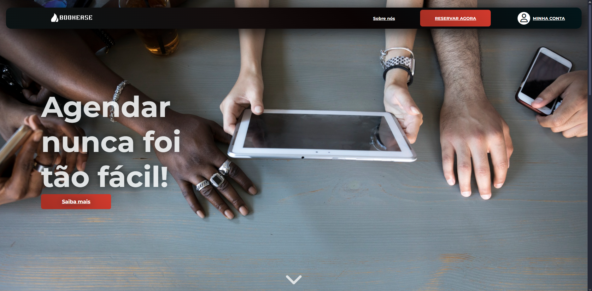
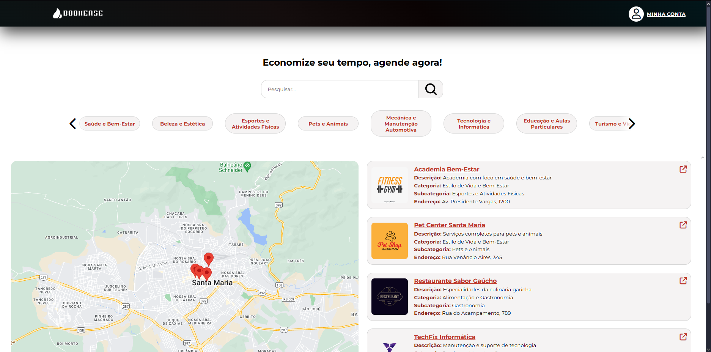
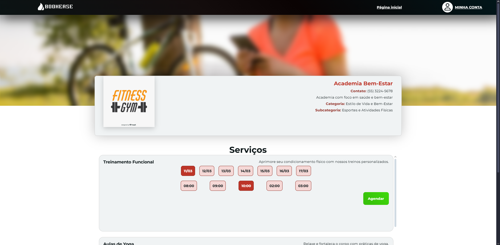
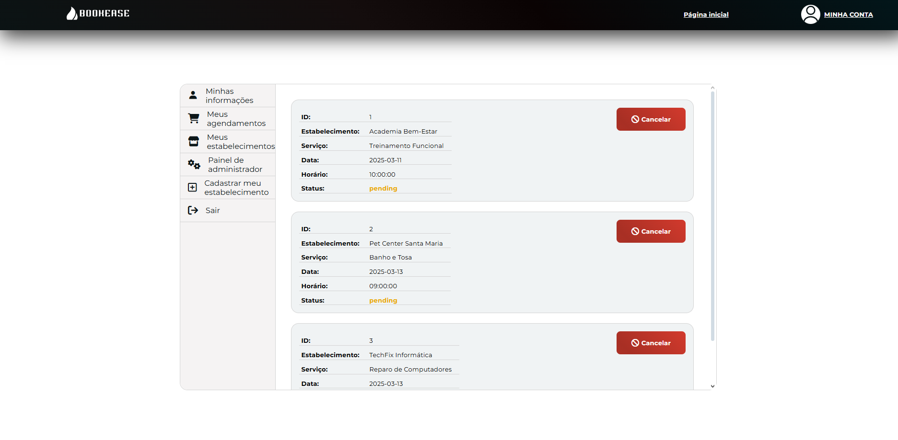
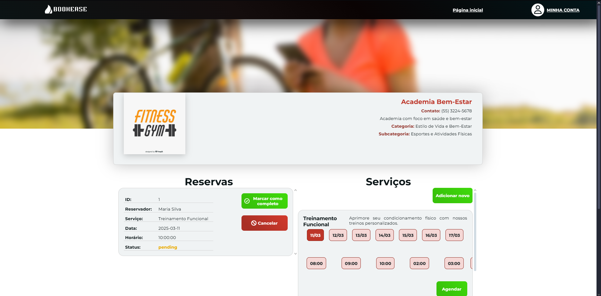
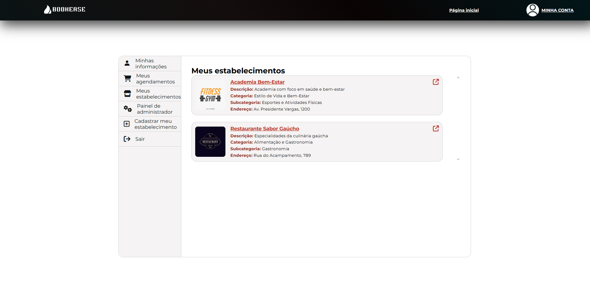

# Bookeasy

## Considerações dos desenvolvedores

> Este software é de uso exclusivo e não pode ser copiado, modificado ou redistribuído sem permissão expressa dos autores [Bruno Bellinaso Brasil](https://github.com/bellinaso) e [Arthur Bernardo Paul](https://github.com/arthurbp08).

## O que é o Bookeasy?

O <strong>Bookeasy</strong> é uma plataforma SaaS desenvolvida para facilitar o gerenciamento de agendamentos de serviços, permitindo que estabelecimentos, prestadores de serviços e usuários finais interajam de forma simples, rápida e centralizada.

Diferentemente das soluções tradicionais, o Bookeasy busca eliminar a dependência de ligações telefônicas e longas trocas de mensagens, oferecendo ao próprio usuário a possibilidade de realizar, consultar e gerenciar seus agendamentos de forma autônoma e intuitiva.

## Proposta

O objetivo do Bookeasy é otimizar o processo de marcação de serviços, proporcionando:

- Maior organização para prestadores de serviço  
- Autonomia para os usuários  
- Redução de erros e conflitos de horário  
- Melhor experiência no atendimento  

## Tecnologias Utilizadas

    <!--php-->
    
    <!--mysql-->
    
    <!--html-->
    
    <!--css-->
    
    <!--js-->
    

## Capturas de tela

## Como executar localmente

1. Utilize o PHP na versão **8.3.0** para garantir maior compatibilidade com o projeto;
2. Execute o script `./model/bookease_database_script.sql` para criar o banco de dados experimental;
3. Para habilitar a funcionalidade de mapas, substitua `API_KEY` em `./view/establishments.php` por uma chave válida da API do Google Maps;
4. Divirta-se!